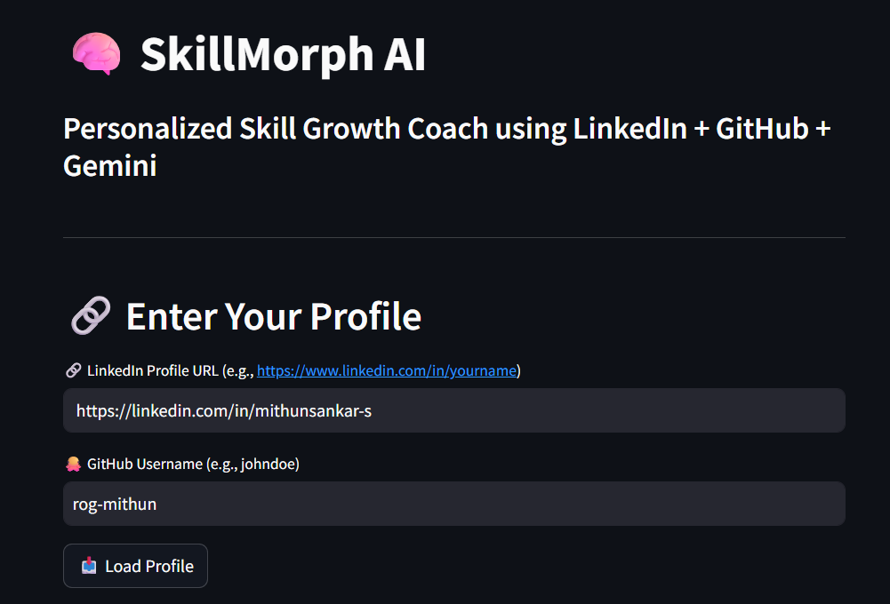
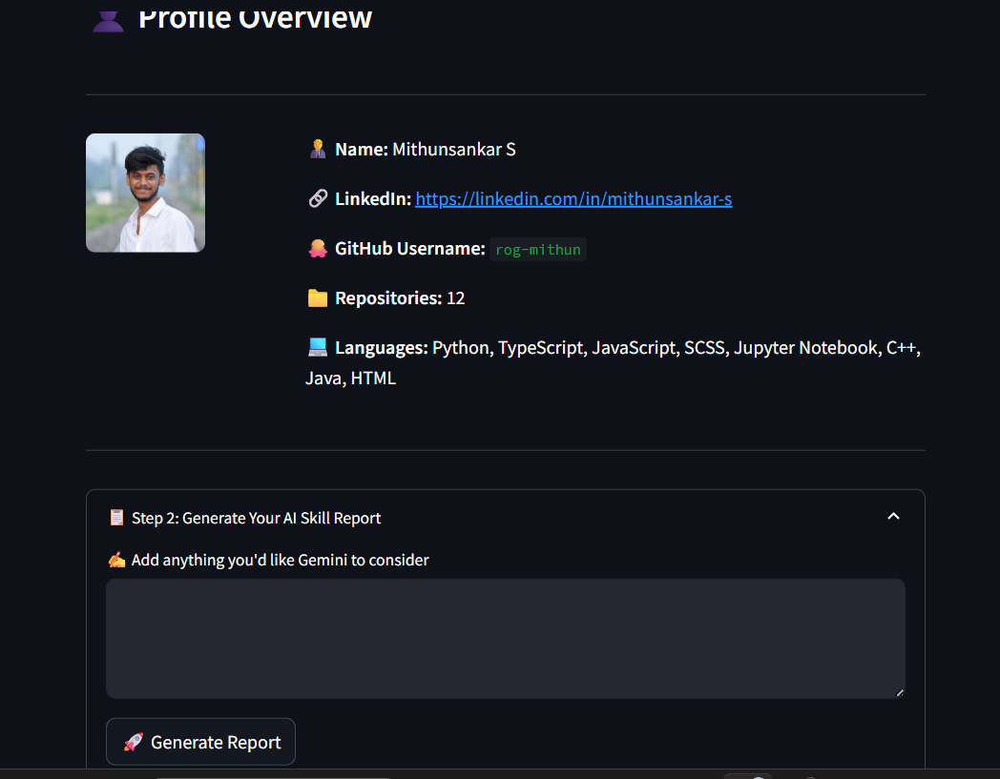

# 🧠 SkillMorph AI – Personalized Career Simulator with AI Feedback and Talking Avatar

SkillMorph AI is a career development tool that uses Generative AI, resume parsing, and real-time visual feedback to help users identify skill gaps, generate personalized weekly upskilling plans, and receive feedback through a talking avatar.

---

## 📌 Key Features

- 📝 Resume Analysis using Google Gemini API  
- 🧠 Skill Feedback & Gap Detection  
- 📅 Weekly Upskilling Planner  
- 🧑‍💼 GitHub & LinkedIn Profile Matching  
- 🗣️ Voice-Based Feedback Generation  
- 🎥 Talking Avatar using SadTalker  
- 🌐 Interactive UI via Streamlit

---

## 🛠️ Tech Stack

### Languages:


### Frameworks & Tools:


### APIs & Integrations:


### Voice & Audio:


### Avatar & Video:


### PDF & Report Generation:


### Utilities:


---

## 📁 Project Structure

| File/Folder             | Description                                  |
|-------------------------|----------------------------------------------|
| `main.py`               | Streamlit app – UI entry point               |
| `resume_reviewer.py`    | Analyzes resume using Gemini API             |
| `job_skill_matcher.py`  | Matches skills with job roles                |
| `weekly_planner.py`     | Generates weekly learning plan               |
| `pdf_generator.py`      | Creates a visual PDF summary                 |
| `feedback_engine.py`    | Compiles AI feedback into structured format  |
| `feedback_voice.py`     | Converts feedback into MP3 audio             |
| `sadtalker_wrapper.py`  | Wraps SadTalker inference pipeline           |
| `github_utils.py`       | Pulls GitHub profile data                    |
| `linkedin_utils.py`     | Pulls LinkedIn profile data                  |
| `requirements.txt`      | Python dependency list                       |
| `SadTalker/`            | Deep learning avatar animation engine        |
| `avatar_input/`         | User-uploaded image for talking avatar       |
| `sadtalker_output.mp4`  | Final avatar video file                      |

---

## 🚀 How to Run

1. **Clone the repository:**
   ```bash
   git clone https://github.com/rog-mithun/skillmorph-ai.git
   cd skillmorph-ai

2. **Install Dependencies:**
   ```bash
   pip install -r requirements.txt

3. **Create a `.env` File and Add Your API Keys:**
   ```bash
   GEMINI_API_KEY=your_google_gemini_api_key
   GITHUB_TOKEN=your_github_token
   LINKEDIN_TOKEN=your_linkedin_token

4. **Run the Streamlit App:**
   ```bash
   streamlit run main.py

---

## 📂 Demo & Output Samples

### 📸 Screenshots – SkillMorph UI
  


### 📄 Sample PDF Reports
- [Master Career Report](media/Master_Career_Report.pdf)
- [Skill Feedback Report](media/skill_report.pdf)

### 🎥 Talking Avatar Demo
[▶️ Watch Output Video](media/sadtalker_output.mp4)

---

## 📖 License
MIT License
© 2025 Mithunsankar S

---


